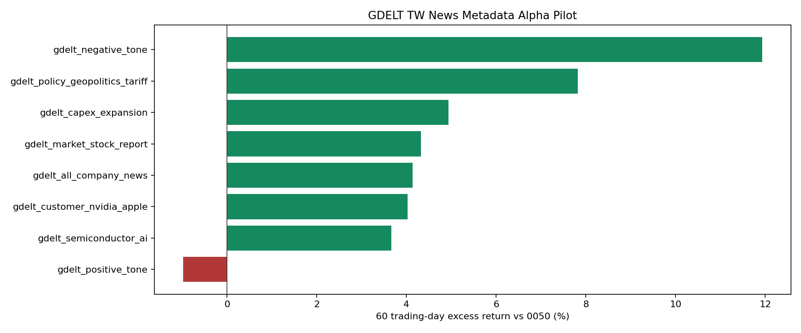

# GDELT 台股新聞 Metadata Alpha Pilot

樣本日期：2025-01-08, 2025-02-12, 2025-03-12, 2025-04-09, 2025-05-14, 2025-06-11, 2025-07-09, 2025-08-13, 2025-09-10, 2025-10-15, 2025-11-12, 2025-12-10；每 `3` 小時抽一個 GKG 檔；價格資料截止：`2026-06-16`。

資料來源：GDELT 2.1 GKG raw metadata。此 pilot 使用 source domain、URL、themes、organizations 與 tone，不保存新聞全文。

股票映射：使用 `research/records/tw_stock_news_aliases.csv`，只啟用高可信 alias，排除容易誤判的簡稱。事件日為 GDELT timestamp 轉 Asia/Taipei 日期，下一個台股交易日收盤為 entry reference。

## 60 日相對 0050 排序

| 排名 | 新聞類型 | label rows | articles | 股票數 | avg tone | 60日有效n | 60日均值 | 60日勝率 | 60日超額均值 | 60日超額勝率 | t-stat | 120日超額均值 |
|---:|---|---:|---:|---:|---:|---:|---:|---:|---:|---:|---:|---:|
| 1 | `gdelt_negative_tone` | 24 | 20 | 5 | -3.67 | 24 | 27.36% | 100.00% | 11.93% | 91.67% | 3.12 | 23.85% |
| 2 | `gdelt_policy_geopolitics_tariff` | 26 | 26 | 3 | -2.13 | 26 | 23.64% | 100.00% | 7.82% | 96.15% | 4.86 | 18.95% |
| 3 | `gdelt_pr_wire_distribution` | 2 | 2 | 2 | 4.45 | 2 | 15.88% | 100.00% | 6.04% | 100.00% | 19.71 | 1.69% |
| 4 | `gdelt_capex_expansion` | 44 | 32 | 8 | -1.17 | 44 | 22.05% | 81.82% | 4.93% | 75.00% | 1.81 | 10.68% |
| 5 | `gdelt_market_stock_report` | 76 | 60 | 9 | -0.71 | 76 | 20.33% | 85.53% | 4.32% | 72.37% | 2.26 | 14.64% |
| 6 | `gdelt_all_company_news` | 126 | 107 | 9 | 0.01 | 126 | 16.67% | 78.57% | 4.13% | 72.22% | 3.25 | 10.41% |
| 7 | `gdelt_customer_nvidia_apple` | 42 | 39 | 4 | 0.36 | 42 | 15.27% | 83.33% | 4.03% | 78.57% | 2.77 | 6.89% |
| 8 | `gdelt_semiconductor_ai` | 76 | 59 | 9 | -0.33 | 76 | 19.17% | 82.89% | 3.66% | 80.26% | 2.06 | 10.56% |
| 9 | `gdelt_positive_tone` | 24 | 22 | 7 | 4.65 | 24 | 10.73% | 70.83% | -0.98% | 58.33% | -0.35 | 3.03% |
| 10 | `gdelt_earnings_revenue` | 4 | 4 | 3 | 2.44 | 4 | 6.93% | 75.00% | -9.17% | 25.00% | -0.85 | -19.75% |

## 股票命中分布

| 股票代號 | articles | avg tone |
|---|---:|---:|
| `2330` | 60 | -0.37 |
| `2317` | 34 | -0.71 |
| `2454` | 8 | 2.11 |
| `2412` | 6 | 0.21 |
| `2382` | 6 | 0.54 |
| `2308` | 5 | 0.23 |
| `2882` | 3 | 1.71 |
| `2303` | 2 | -3.96 |
| `2881` | 2 | -0.93 |

## 研究限制

- 這是 GDELT hourly 抽樣，不是全量新聞庫；只能判斷這條資料管線是否值得擴大。
- GKG 沒有完整標題或全文，本 pilot 先用 metadata 分類；若某類型有顯著 Alpha，再接 DOC/RSS/原站頁面做標題與摘要級 LLM 標籤。
- 目前股票 universe 只含高可信 alias 的大型台股；擴大到全市場前，必須先建立公司別名與消歧義資料表。
