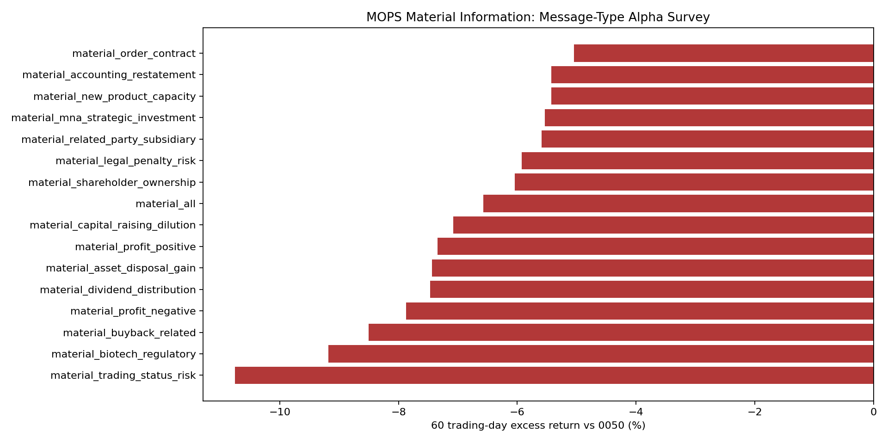

# MOPS 重大訊息 Alpha Survey

事件樣本：`2025-01-01` 至 `2025-12-31` 的公開資訊觀測站 `t05st02` 重大訊息；價格資料截止：`2026-06-16`。

回測口徑：事件日後第一個交易日收盤作為 entry reference，使用 total-return adjusted close，計算 5/20/60/120 個交易日後報酬；`excess` 是同期間相對 0050 total-return 的超額報酬。

這份研究只儲存分類、主旨、hash 與統計結果；完整文字只保留在本機 raw cache 供驗證，不進入報告。

## 60 日相對 0050 排序

| 排名 | 消息類型 | label rows | 事件數 | 60日有效n | 60日均值 | 60日勝率 | 60日超額均值 | 60日超額勝率 | t-stat | 120日超額均值 |
|---:|---|---:|---:|---:|---:|---:|---:|---:|---:|---:|
| 1 | `material_order_contract` | 386 | 386 | 382 | -6.99% | 27.49% | -5.05% | 36.39% | -5.37 | -18.18% |
| 2 | `material_accounting_restatement` | 3,421 | 3,406 | 3,377 | -6.15% | 26.59% | -5.43% | 31.86% | -15.79 | -15.62% |
| 3 | `material_new_product_capacity` | 1,194 | 1,188 | 1,171 | -8.00% | 23.65% | -5.43% | 32.02% | -7.92 | -16.63% |
| 4 | `material_mna_strategic_investment` | 1,702 | 1,699 | 1,682 | -7.56% | 26.75% | -5.54% | 34.66% | -11.94 | -16.03% |
| 5 | `material_related_party_subsidiary` | 3,258 | 3,163 | 3,229 | -6.55% | 24.90% | -5.59% | 32.70% | -18.24 | -16.37% |
| 6 | `material_legal_penalty_risk` | 993 | 987 | 968 | -8.28% | 24.07% | -5.93% | 32.23% | -7.99 | -17.93% |
| 7 | `material_shareholder_ownership` | 5,544 | 5,221 | 5,477 | -7.77% | 24.32% | -6.04% | 32.83% | -25.30 | -17.33% |
| 8 | `material_all` | 19,190 | 17,521 | 18,948 | -8.06% | 22.71% | -6.57% | 29.51% | -50.43 | -16.72% |
| 9 | `material_other` | 804 | 800 | 801 | -7.79% | 24.97% | -6.69% | 31.09% | -11.27 | -12.73% |
| 10 | `material_routine_governance` | 15,188 | 13,540 | 14,996 | -8.19% | 21.72% | -6.74% | 28.53% | -47.34 | -16.88% |
| 11 | `material_capital_raising_dilution` | 2,157 | 2,146 | 2,137 | -7.55% | 24.57% | -7.08% | 27.00% | -16.23 | -15.47% |
| 12 | `material_profit_positive` | 2,247 | 2,234 | 2,225 | -8.74% | 20.27% | -7.34% | 26.52% | -19.48 | -15.76% |
| 13 | `material_asset_disposal_gain` | 591 | 588 | 587 | -7.80% | 23.68% | -7.44% | 24.87% | -12.16 | -19.64% |
| 14 | `material_dividend_distribution` | 4,368 | 4,002 | 4,319 | -7.63% | 21.49% | -7.46% | 24.75% | -28.18 | -17.58% |
| 15 | `material_profit_negative` | 1,386 | 1,367 | 1,361 | -7.02% | 24.76% | -7.87% | 26.45% | -12.63 | -17.71% |
| 16 | `material_buyback_related` | 487 | 483 | 484 | -5.36% | 30.17% | -8.50% | 26.24% | -10.42 | -18.52% |
| 17 | `material_biotech_regulatory` | 110 | 110 | 109 | -10.24% | 21.10% | -9.18% | 25.69% | -6.56 | -20.93% |
| 18 | `material_trading_status_risk` | 37 | 37 | 33 | -12.67% | 12.12% | -10.75% | 24.24% | -3.15 | -28.79% |

## 代表主旨樣本

### `material_order_contract`
- 澄清不實訊息
- 台積公司2025年第一季每股盈餘新台幣13.94元
- 本公司之子公司Delta Power Equipment Corporation與 P&F BROTHER INDUSTRIAL CORPO
- 公告本公司對子公司J&B International Ltd. 背書保證達公開發行公司資金貸與及背書保證處理準則 第二十五條第四款之公告標準
- 澄清114年04月18日經濟日報C03版報導內容

### `material_accounting_restatement`
- 代子公司第一銀行公告代理發言人異動
- 公告本公司重要營運主管異動(修正)
- 本公司代重要子公司聖暉系統集成集團股份有限公司公告 2024年度股東常會重要決議事項
- 公告本公司代理發言人異動事宜
- 公告本公司一一四年股東常會全面改選董事(含獨立董事) 當選情形(三分之一以上董事發生變動)

### `material_new_product_capacity`
- 公告本公司代理發言人異動
- 公告本公司內部稽核主管異動
- 公告本公司重要營運主管異動(修正)
- 代重要子公司康躍科技公告主辦會計異動
- 公告本公司代理發言人異動事宜

### `material_mna_strategic_investment`
- 代本公司之子公司茂嘉能源股份有限公司下稱「茂嘉」公告 訂購太陽能發電設備及工程(修正110/11/19公告)
- 係因本公司有價證券於集中交易市場達公布注意交易資訊標準， 故公布相關財務業務等重大訊息，以利投資人區別瞭解。
- 本公司有價證券近期達公佈注意交易資訊標準， 故公告相關訊息，以利投資人區別暸解
- 公告本公司列入合併財務報告之各子公司114年03月底之 負債比率、流動比率、速動比率
- 本公司有價證券達公布注意交易資訊標準，故公布相關 訊息，以利投資人區別瞭解。

### `material_related_party_subsidiary`
- 本公司代子公司玉山銀行公告董事會決議盈餘轉增資發行 新股
- 本公司代重要子公司 China Metal International Holdings Inc. 公告114年股東常會重要決議事項
- 本公司代重要子公司璞真建設股份有限公司公告董事會 改選董事長
- 代子公司鼎固置業股份有限公司公告 累計取得有價證券達新台幣三億元
- 代重要子公司芝和精密股份有限公司公告董事會通過 114年股東會召開事宜

### `material_dividend_distribution`
- 公告本公司董事會決議買回庫藏股
- 代重要子公司恒瑋電子材料(昆山)有限公司公告 董事會決議分配盈餘案
- 代重要子公司TRANS-SUN INTERNATIONAL CO., LTD.公告 董事會決議分配盈餘案
- 本公司董事會決議召開114年股東常會相關事宜(新增議案)
- 代子公司三商行股份有限公司公告除息基準日

### `material_profit_negative`
- 代子公司明揚國際科技股份有限公司公告 董事會(代行股東會職權)重要決議事項
- 本公司有價證券近期多次達公佈注意交易資訊標準，故公告相關訊 息，以利投資人區別暸解
- 公告本公司董事會決議買回庫藏股
- 本公司董事會決議辦理現金減資退還股款案
- 澄清時報資訊媒體報導

### `material_buyback_related`
- 本公司董事會決議買回庫藏股
- 公告本公司董事會通過買回本公司股份(即實施庫藏股)乙案
- 公告本公司董事會決議買回庫藏股(更正買回股份總金額上限)
- 公告本公司第十四次買回庫藏股執行完畢
- 公告本公司董事會決議買回庫藏股

### `material_biotech_regulatory`
- 代子公司Polaris Pharmaceuticals, Inc.公告 與Er-Kim Pharmaceuticals簽訂商業化及通路銷售合
- 代子公司共信醫療器材股份有限公司與G公司簽訂 本公司產品樂安醫藥外敷凝膠台灣總經銷協議
- 代子公司Polaris Pharmaceuticals, Inc.公告 與Tabuk Pharmaceutical Manufacturin
- 公告本公司今日接獲註冊代理人通知，澳洲藥物管理局(TGA)受理 Bonvadis外用乳膏完全傷口適應症醫材產品註冊申請。
- 本公司112年現金增資之資金運用計劃項目變更

### `material_trading_status_risk`
- 依證券商營業處所買賣有價證券業務規則公告本公司股票繼續維持 變更交易方法
- 公告本公司繼續維持變更交易方法暨分盤方式交易， 惟本公司變更交易之事由已有變動，新增會計師出具繼續經營能力 存在重大不確定性之查核報告
- 公告本公司自114年4月7日起恢復為普通交割方式之買賣
- 公告本公司接獲證交所通知本公司上市有價證券列為變更 交易方法
- 本公司處置軒轅劍智慧財產權(全球）已收足50%款項， 滿足移轉交割條件

## 初步判讀

- 正向 alpha 需要同時看 `60日超額均值`、`60日超額勝率` 與 `t-stat`；樣本少但均值高的類別只能當研究線索，不能直接當交易策略。
- 負向 alpha 類型同樣有價值，較適合作為持股風險過濾器或事件風險降槓桿條件。
- 下一步若要進入策略層，應把強訊息類型與價格動能、月營收成長、法人籌碼、流動性、產業輪動做交互，並用 walk-forward 驗證，而不是直接買所有事件。
