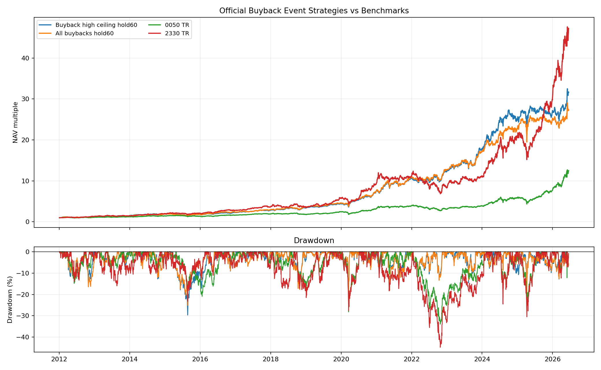

# 官方消息面最小實驗：庫藏股公告事件研究

資料下載時間：`2026-06-17T14:52:39+00:00` UTC。
資料來源：MOPS `t35sc09` 公司買回自己公司股份彙總統計表：`https://mopsov.twse.com.tw/mops/web/ajax_t35sc09`。
價格資料截止：`2026-06-16`；回測起點：`2012-01-03`；價格使用 total-return adjusted close。

## 下載驗證

| 市場 | 原始檔 | 解析事件數 |
|---|---|---:|
| sii | `var/out/experiments/mops_t35sc09_buyback_sii_2026-06-17.html` | 3,559 |
| otc | `var/out/experiments/mops_t35sc09_buyback_otc_2026-06-17.html` | 2,154 |

## 事件標籤

本實驗只使用公告當下可見欄位，不使用後續實際買回股數、執行比例、未執行原因等未來資訊。

- `purpose_3_support`：買回目的代碼為 3，通常對應維護公司信用與股東權益。
- `high_price_ceiling`：公告買回最高價比進場日收盤價高 20% 以上。
- `large_authorization`：預定最高買回金額 / 法定買回上限 >= 3%。
- `deep_pre_drop`：公告前約 20 個交易日跌幅 <= -5%。

## 事件後報酬

| 標籤 | n | 20日均值 | 20日勝率 | 60日均值 | 60日勝率 | 120日均值 | 120日勝率 |
|---|---:|---:|---:|---:|---:|---:|---:|
| `purpose3_after_drop` | 396 | 7.79% | 76.14% | 13.41% | 73.39% | 20.41% | 67.02% |
| `purpose_2` | 5 | 5.82% | 100.00% | 10.81% | 75.00% | 17.76% | 100.00% |
| `purpose_1` | 1,513 | 5.38% | 65.66% | 8.58% | 61.71% | 16.60% | 61.33% |
| `high_price_ceiling` | 2,341 | 5.28% | 67.34% | 8.51% | 63.26% | 15.79% | 62.70% |
| `large_authorization` | 2,250 | 5.26% | 66.64% | 8.18% | 62.47% | 14.96% | 61.35% |
| `all_buybacks` | 2,572 | 5.09% | 66.59% | 8.11% | 62.40% | 14.93% | 61.27% |
| `purpose3_high_ceiling` | 941 | 4.96% | 68.94% | 7.84% | 63.81% | 13.59% | 62.68% |
| `purpose3_large_high` | 852 | 5.08% | 68.87% | 7.79% | 63.76% | 13.28% | 62.42% |
| `purpose_3_support` | 1,054 | 4.67% | 67.75% | 7.44% | 63.33% | 12.55% | 61.04% |

## 固定持有策略回測

策略規則：公告後下一個交易日收盤建立部位，最多同時持有 10 檔，等權，固定持有 20 或 60 個交易日；含手續費與賣出交易稅。

| 策略 | CAGR | 最近一年 CAGR | Sortino | MDD | 訊號數 | 平均持股 |
|---|---:|---:|---:|---:|---:|---:|
| `2330 TR` | 30.58% | 137.41% | 1.760 | -44.80% | - | - |
| `high_price_ceiling_hold60` | 27.00% | 14.36% | 1.935 | -29.68% | 2196 | 9.67 |
| `purpose3_high_ceiling_hold20` | 25.89% | 6.78% | 1.525 | -35.30% | 935 | 3.96 |
| `all_buybacks_hold60` | 25.68% | 8.05% | 1.799 | -25.14% | 2406 | 9.76 |
| `purpose3_large_high_hold20` | 25.56% | -10.18% | 1.452 | -38.58% | 849 | 3.63 |
| `high_price_ceiling_hold20` | 25.14% | 6.45% | 1.774 | -31.38% | 2196 | 7.10 |
| `all_buybacks_hold20` | 24.83% | 8.70% | 1.720 | -26.07% | 2406 | 7.46 |
| `purpose_3_support_hold20` | 24.79% | 7.99% | 1.480 | -31.87% | 1045 | 4.36 |
| `0050 TR` | 19.10% | 119.88% | 1.292 | -33.96% | - | - |
| `purpose3_high_ceiling_hold60` | 17.91% | 7.37% | 1.199 | -38.70% | 935 | 7.73 |
| `purpose_3_support_hold60` | 17.37% | 15.14% | 1.180 | -32.79% | 1045 | 8.06 |
| `purpose3_large_high_hold60` | 15.33% | -1.02% | 0.995 | -42.32% | 849 | 7.19 |
| `purpose3_after_drop_hold20` | 13.25% | 23.46% | 0.595 | -35.80% | 388 | 1.47 |
| `purpose3_after_drop_hold60` | -0.02% | 14.75% | -0.055 | -68.16% | 388 | 3.52 |

## 初步結論

庫藏股公告本身有可量化的事件訊號，但第一輪最小回測尚未形成足以取代既有策略或 2330/0050 benchmark 的強策略。它比較適合成為消息面特徵之一，下一步應與營收動能、技術突破、法人籌碼、產業催化一起做交互條件，而不是單獨交易。
