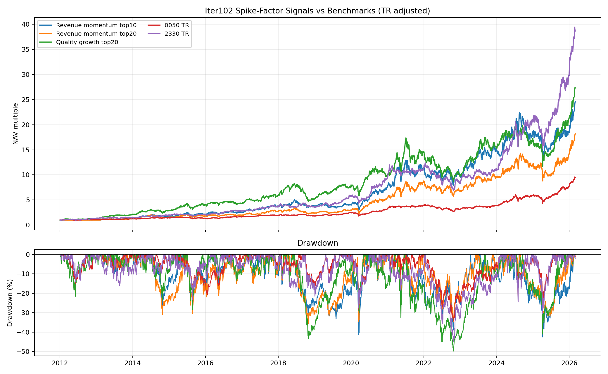

# 暴漲股因子研究：60 日 +80% 事件

資料截止：價格 / 籌碼至 `2026-06-16`；月營收至本地 cache 最新可用月份。
研究窗口：`2012-01-03` - `2026-06-16`。

## 方法

- Spike 定義：未來 60 個交易日 total-return adjusted close 漲幅 >= 80%。
- 測試頻率：每月第一個交易日做一次全市場截面觀察，避免每日樣本高度重疊。
- Universe：排除 ETF / 金融股 / 掛牌未滿 252 交易日 / 60 日均成交值低於 3,000 萬 / 股價低於 10 元。
- 因子全部使用當下可見資料，不使用未來資訊。

## 基準機率

- 月頻有效樣本數：`89,851`。
- 基準 spike 機率：`1.324%`。

## 單因子排序

| 因子 | Top 10% spike率 | Lift | Top 10% 60日均報酬 | Top 20% spike率 | Top 20% Lift |
|---|---:|---:|---:|---:|---:|
| 120 日動能強 | 3.545% | 2.68x | 5.25% | 2.877% | 2.17x |
| 60 日動能強 | 3.204% | 2.42x | 4.24% | 2.771% | 2.09x |
| 20 日動能強 | 2.879% | 2.17x | 4.03% | 2.292% | 1.73x |
| 站在 60 日區間高位 | 2.468% | 1.86x | 5.03% | 2.192% | 1.66x |
| 接近 52 週高點 | 2.396% | 1.81x | 5.82% | 2.043% | 1.54x |
| 月營收 YoY 高 | 2.363% | 1.78x | 2.98% | 2.091% | 1.58x |
| 月營收加速度高 | 2.065% | 1.56x | 2.21% | 1.886% | 1.42x |
| 成交量突然放大 | 1.982% | 1.50x | 2.71% | 1.831% | 1.38x |
| 毛利率高 | 1.534% | 1.16x | 2.32% | 1.307% | 0.99x |
| Piotroski F-score 高 | 1.486% | 1.12x | 3.29% | 1.498% | 1.13x |

## 組合訊號

| 組合 | 條件 | 樣本數 | spike率 | Lift | 60日均報酬 | 60日 +20% 機率 |
|---|---|---:|---:|---:|---:|---:|
| `revenue_momentum` | 月營收YoY>30 + 加速度正 + 60日動能前20% + 接近高點 | 3,909 | 3.633% | 2.74x | 6.28% | 23.15% |
| `momentum_new_high` | 近高點 + 60日動能前20% + 60日RSV高 | 9,198 | 3.088% | 2.33x | 5.56% | 21.64% |
| `volume_breakout` | 量能>1.5倍 + 20日漲幅>10% + 接近高點 | 5,011 | 3.033% | 2.29x | 5.22% | 21.05% |
| `quality_growth_breakout` | 月營收YoY>20 + ROA>8% + F-score>=4 + 120日動能前20% | 3,020 | 3.013% | 2.28x | 6.40% | 24.04% |
| `institutional_breakout` | 法人流前20% + 接近高點 + 60日動能前20% | 3,219 | 2.361% | 1.78x | 5.51% | 19.73% |
| `cheap_growth_momentum` | PE<20 + 月營收YoY>20 + 60日動能>10% | 4,633 | 1.640% | 1.24x | 4.54% | 18.11% |

## 訊號層 target-book 回測

這一段是把上面的 spike setup 當成「每月選股訊號」做 target-book 粗回測，目的是檢查因子能不能從事件統計轉成可交易的方向。
回測使用 total-return adjusted price，包含手續費與賣出交易稅，但尚未加入完整 order-level next-open 成交、滑價與流動性排隊模擬，因此只能視為研究層驗證，不能直接視為可上線策略。

回測窗口：`2012-01-03` - `2026-03-02`。結束日早於資料截止日，是因為 spike label 需要完整未來 60 個交易日。
最近一年窗口：`2025-02-27` - `2026-03-02`。

| 策略 / Benchmark | CAGR | 最近一年 CAGR | Sortino | MDD | 平均持股 | 月均 turnover |
|---|---:|---:|---:|---:|---:|---:|
| 2330 TR | 29.45% | 92.06% | 1.713 | -44.80% | - | - |
| `quality_growth_breakout_top20` | 26.31% | 72.94% | 1.174 | -49.78% | 14.94 | 1.13 |
| `revenue_momentum_top10` | 25.39% | 38.12% | 1.070 | -42.53% | 9.04 | 1.78 |
| `revenue_momentum_top20` | 22.73% | 54.10% | 0.973 | -38.56% | 15.71 | 1.69 |
| `momentum_new_high_top20` | 22.04% | 54.81% | 0.986 | -49.88% | 18.16 | 1.69 |
| `spike_setup_blend_top10` | 21.62% | 42.26% | 0.884 | -47.00% | 8.99 | 1.79 |
| 0050 TR | 17.22% | 64.91% | 1.240 | -33.96% | - | - |

判讀：

- spike 因子確實有 alpha 訊號：最佳組合的長期 CAGR 明顯高於 0050 TR，且大漲事件機率約為全市場基準的 2.3-2.7 倍。
- 但它沒有全面勝過 2330 TR，且 MDD 普遍偏深；尤其 `quality_growth_breakout_top5` 雖然 CAGR 高，最近一年為負且 MDD 接近 -70%，不適合作為實盤候選。
- `revenue_momentum_top10` 是目前訊號層較平衡的版本：CAGR 25.39%、MDD -42.53%、平均持股約 9 檔；但仍需加入更嚴格的出場、停損、流動性與 next-open 成交模擬，才可能進入策略候選。

## 最新截面高分名單

這不是買進建議，只是把歷史 spike setup score 最高的股票列出，供後續人工研究新聞、產業與籌碼原因。

| 日期 | 股票 | 收盤 | 月營收YoY | YoY加速度 | 20日報酬 | 60日報酬 | 近52週高點 | 量能倍率 | PE | score |
|---|---:|---:|---:|---:|---:|---:|---:|---:|---:|---:|
| 2026-06-16 | 6613 | 360.00 | 81.72% | 50.90% | 44.87% | 83.67% | 100.00% | 7.75 | 25.3 | 0.929 |
| 2026-06-16 | 3147 | 350.00 | 812.45% | 722.37% | 93.37% | 101.15% | 100.00% | 0.86 | 39.2 | 0.895 |
| 2026-06-16 | 8926 | 76.80 | 768.17% | 235.36% | 34.74% | 63.58% | 100.00% | 2.02 | 18.8 | 0.891 |
| 2026-06-16 | 1714 | 17.95 | 84.85% | 13.13% | 85.63% | 86.40% | 100.00% | 2.30 | 28.1 | 0.886 |
| 2026-06-16 | 3441 | 81.00 | 46.19% | 1.29% | 87.86% | 159.56% | 100.00% | 4.89 | 71.0 | 0.882 |
| 2026-06-16 | 8043 | 211.00 | 59.57% | 32.76% | 85.90% | 180.21% | 100.00% | 3.36 | 63.4 | 0.882 |
| 2026-06-16 | 2493 | 250.00 | 24.91% | 28.02% | 90.11% | 114.59% | 100.00% | 1.89 | 59.1 | 0.872 |
| 2026-06-16 | 6465 | 64.00 | 169.58% | 88.56% | 37.46% | 42.97% | 95.95% | 4.27 | 24.7 | 0.863 |
| 2026-06-16 | 6166 | 138.00 | 79.46% | 16.29% | 21.59% | 125.49% | 97.87% | 1.38 | 38.2 | 0.863 |
| 2026-06-16 | 3290 | 66.00 | 96.16% | 26.81% | 42.39% | 48.15% | 100.00% | 2.78 | 14.2 | 0.862 |
| 2026-06-16 | 5410 | 46.20 | 199.23% | 76.95% | 23.36% | 49.51% | 96.25% | 2.92 | 14.6 | 0.861 |
| 2026-06-16 | 3624 | 142.00 | 30.83% | 9.86% | 55.70% | 174.66% | 100.00% | 5.17 | 68.6 | 0.859 |
| 2026-06-16 | 2344 | 197.00 | 181.97% | -0.26% | 67.66% | 54.71% | 100.00% | 1.67 | 58.5 | 0.855 |
| 2026-06-16 | 3008 | 4860.00 | 42.67% | 18.19% | 44.43% | 103.52% | 100.00% | 1.66 | 30.3 | 0.854 |
| 2026-06-16 | 3044 | 546.00 | 46.57% | 17.67% | 18.05% | 46.18% | 100.00% | 1.47 | 26.5 | 0.853 |

## 初步結論

大漲股不是單一因子可以解釋。最有用的方向通常是「已經接近新高 / 中短期動能強 / 量能放大 / 基本面或月營收沒有背離」。
這類訊號比較適合做候選池與人工研究入口；是否能直接買進，仍需要用下一階段 target-book 回測驗證進出場、停損與持有規則。
