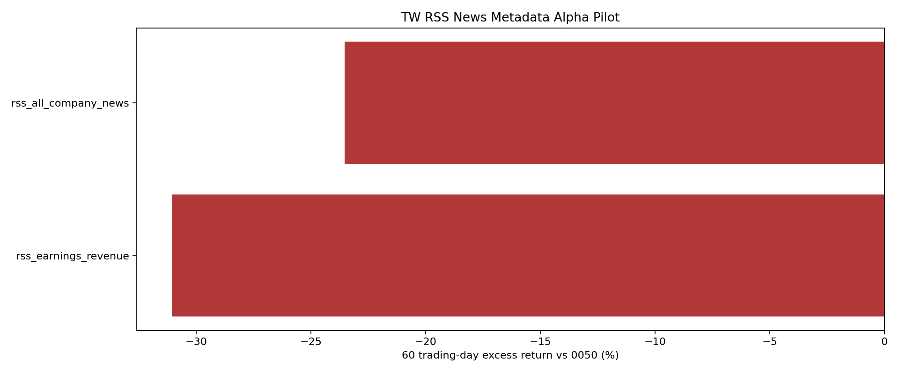

# 台股 RSS 新聞 Metadata Alpha Pilot

樣本股票：`2330, 2317, 2454`；每個 RSS feed 最多 `5` 筆；價格資料截止：`2026-06-16`。

資料來源：Yahoo 個股 RSS 與 Google News RSS。此 pilot 保存標題、URL、來源與分類 metadata，不保存新聞全文。

RSS 是近期資料源，主要驗證 live/news ingestion 與分類流程；若文章太新，forward return 會自然留空，不能被解讀為歷史 Alpha。

- event label rows: `60`
- usable labeled rows: `11`
- unique articles: `19`

## 60 日相對 0050 排序

| 排名 | 新聞類型 | label rows | articles | 股票數 | 60日有效n | 60日均值 | 60日勝率 | 60日超額均值 | 60日超額勝率 | t-stat | 120日超額均值 |
|---:|---|---:|---:|---:|---:|---:|---:|---:|---:|---:|---:|
| 1 | `rss_all_company_news` | 7 | 7 | 3 | 2 | 2.21% | 50.00% | -23.53% | 0.00% | -3.13 | - |
| 2 | `rss_earnings_revenue` | 2 | 2 | 1 | 1 | -9.80% | 0.00% | -31.06% | 0.00% | - | - |
| 3 | `rss_market_stock_report` | 1 | 1 | 1 | 0 | - | - | - | - | - | - |
| 4 | `rss_semiconductor_ai` | 1 | 1 | 1 | 0 | - | - | - | - | - | - |

## 近期文章樣本

| 日期 | 股票 | 來源 | 標題 |
|---|---|---|---|
| 2026-06-17 | `2317` | `yahoo_tw_stock_rss` | AI需求爆發台廠賺翻! 台積電繳營所稅近2千億蟬聯"繳稅王" |
| 2026-06-17 | `2330` | `yahoo_tw_stock_rss` | AI需求爆發台廠賺翻! 台積電繳營所稅近2千億蟬聯"繳稅王" |
| 2026-06-17 | `2330` | `yahoo_tw_stock_rss` | 艾克爾台積電簽10年合作協議　強化美半導體先進封裝 |
| 2026-06-17 | `2330` | `yahoo_tw_stock_rss` | 台積電訂單恐被「英特爾1晶片」搶走！外媒示警了 |
| 2026-06-17 | `2317` | `yahoo_tw_stock_rss` | 鴻海與Bull合作正式進入執行階段 在歐洲生產Vera Rubin |
| 2026-06-17 | `2317` | `yahoo_tw_stock_rss` | AI概念發威！台積電繳稅近2千億穩居稅王 廣達擠入前3 |
| 2026-06-17 | `2330` | `yahoo_tw_stock_rss` | AI概念發威！台積電繳稅近2千億穩居稅王 廣達擠入前3 |
| 2026-06-17 | `2330` | `google_news_rss` | 台積電(2330)從170元抱到2300元！他身價翻14倍「1天獲利比工作1年還多」：聯發科(2454)慘賠500萬後，我學會這件事 - 今周刊 |
| 2026-06-17 | `2454` | `google_news_rss` | 台積電(2330)從170元抱到2300元！他身價翻14倍「1天獲利比工作1年還多」：聯發科(2454)慘賠500萬後，我學會這件事 - 今周刊 |
| 2026-06-17 | `2454` | `google_news_rss` | 郭明錤：聯發科升級AI業務策略 初期鎖定谷歌TPU與馬斯克L10機架 - news.cnyes.com |
| 2026-06-17 | `2330` | `google_news_rss` | 下一波飆股不是GPU？高盛揭新風向點名台積電、聯發科目標價衝5000元 「這一檔」目標價22000元新天價 - Yahoo股市 |
| 2026-06-17 | `2454` | `google_news_rss` | 下一波飆股不是GPU？高盛揭新風向點名台積電、聯發科目標價衝5000元 「這一檔」目標價22000元新天價 - Yahoo股市 |
| 2026-06-17 | `2330` | `google_news_rss` | Taiwan Semiconductor Manufacturing Co Ltd(TSM)股票6月16日收盤下跌3.42%：投資者必看的核心資訊 - HK MoneyClub |
| 2026-06-17 | `2317` | `google_news_rss` | Hon Hai與Schneider將共同開發下一代AI數據中心 - 富途牛牛 |
| 2026-06-16 | `2330` | `google_news_rss` | 尾盤爆大單原因曝光！台積電、聯發科被神祕資金硬拉「明天將迎歷史級軋空行情？」外資拋售慘業名單竟然有它們- 上市櫃 - 旺得富理財網 |
| 2026-06-16 | `2454` | `google_news_rss` | 尾盤爆大單原因曝光！台積電、聯發科被神祕資金硬拉「明天將迎歷史級軋空行情？」外資拋售慘業名單竟然有它們- 上市櫃 - 旺得富理財網 |
| 2026-06-16 | `2330` | `google_news_rss` | TSMC和Amkor Technology宣佈建立長期合作伙伴關係，以加速在美國的先進封裝業務。 - Moomoo |
| 2026-06-15 | `2330` | `google_news_rss` | Taiwan Semiconductor Manufacturing Co Ltd(TSM)股票6月15日開盤上漲3.74%：關鍵驅動因素揭曉 - TradingKey |
| 2026-06-10 | `2454` | `google_news_rss` | 聯發科「抓去關」挨轟　金管會：調整警示標準、縮短處置期 - ETtoday財經雲 |
| 2026-06-09 | `2330` | `google_news_rss` | 《TAIPEI TIMES》 TSMC doubles market cap, climbs to ninth in rankings - 自由時報 |